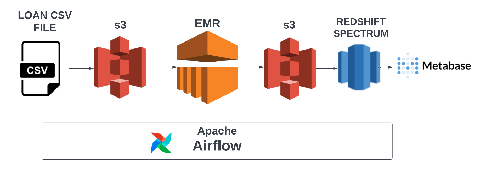
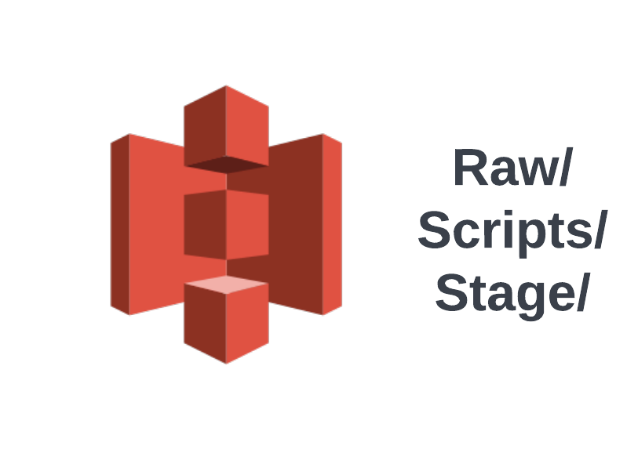
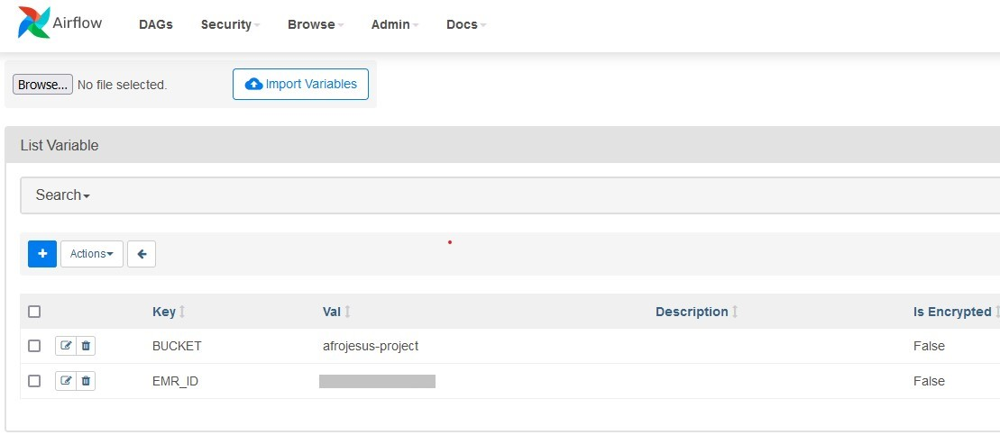
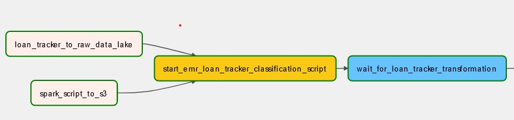
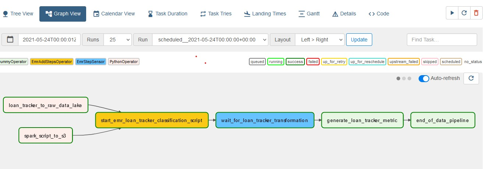
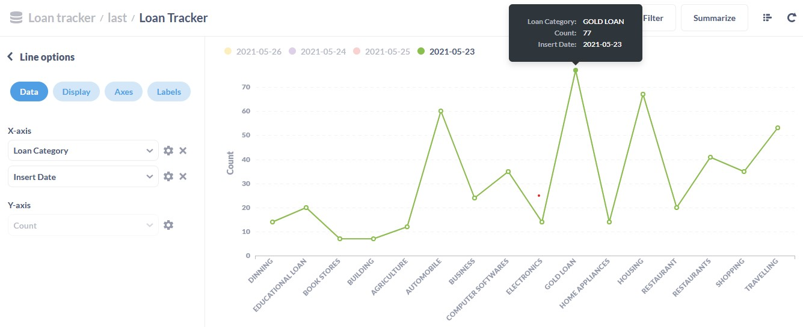

# beginners_batch_project

### Introduction
Batch processing is one of the sort after requirements for data engineering roles and getting a data engineering project running batch processing on the cloud can be time consuming. This tutorial covers some core components of batch processing you can apply to your own projects in no time. 

This tutorial was made possible by [startdataengineering](https://www.startdataengineering.com/post/data-engineering-project-for-beginners-batch-edition/#3-design) for those who are eager to get into the data engineering field, you can start from there.

### Objective
Lets assume you work for a bank as a data engineer and you have been tasked to create a batch processing workflow that tracks the number of loan in each loan category of the bank every day. Using your experience as a data engineer you need to make the loan tracker metric data available to both decision-makers and end users.

### Setup

#### Prerequisite
- Docker 
- AWS account
- AWS CLI installed and configured

Clone and cd into the project directory.

```
git clone https://github.com/Adematics/beginners_batch_project
cd beginners_batch_project
```

For this project we use
- 3 **m4.xlarge** type nodes for our AWS EMR cluster.
- 1 **dc2.large** for our AWS Redshift cluster.
- 1 **iam role** to allow Redshift access to S3.
- 1 **S3** bucket with about 150MB in size.
- 1 **t2.large** AWS EC2 instance

#### Design
We use Airflow for our workflow orchestration to orchestrate the following.

- Classify our loan tracker metrics using Apache Spark.

- Load the loan tracker metrics into our data warehouse.





- Lastly we use Metabase for visualization of our loan tracker metrics.


#### Deploy AWS infrastructure
To setup our AWS infrastructure we run the [setup_infra.sh](https://github.com/Adematics/beginners_batch_project/blob/main/setup_infra.sh)  script in our project.

```
./setup_infra.sh {your-bucket-name} # e.g ./setup_infra.sh my-bucket-project
```

The default region set for this project is us-west-1 . You can modify the region to your own region in the [infra_variables.txt.](https://github.com/Adematics/beginners_batch_project/blob/main/infra_variables.txt) file and [setup_infra.sh](https://github.com/Adematics/beginners_batch_project/blob/main/setup_infra.sh) file in your project directory.

The setup script sets up the following components.
- 1 AWS EC2, running Airflow and Metabase
- 1 AWS EMR cluster
- 1 AWS Redshift cluster
- 1 AWS S3 bucket

After the script finish running you can login to your
- Airflow running on port localhost:8080 (username and password are both airflow)
- Metabase running on port localhost:3000

The first time you log in to your metabase account, you will need to create a user name and password. To  establish a connection to your Redshift cluster, you will need your redshift host, which you can get using the command below.
```
aws redshift describe-clusters --cluster-identifier sde-batch-project --query 'Clusters[0].Endpoint.Address' --output text
```
The port, username, and password are in your [infra_variables.txt](https://github.com/Adematics/beginners_batch_project/blob/main/infra_variables.txt) and the database used is dev.

We also need to run the [redshift-setup.sh](https://github.com/Adematics/beginners_batch_project/blob/main/redshift-setup.sh) file in our directory after setting up our infrastructure to setup our schema for our redshift data warehouse used for this project.


```
./redshift-setup.sh # This sets up our redshift schema.
``` 


#### Data lake structure
The data lake which is AWS S3 consist of the directories where our data would be stored before and after being processed. This data lake contains different directory in one bucket which consists of
- **raw** : To store our raw data in our data lake before being processed.
- **scripts** : This is where our **spark script** is stored which will be used by AWS EMR.
- **stage** : This is where our loan tracker metric data will be stored after being processed.



#### Airflow configurations
The setup script also sets up Airflow connections and variables.
- **Redshift connection** : Used to connect to our AWS Redshift cluster.
- **BUCKET variable** : Used to indicate the bucket to be used as the data lake for our pipeline.
- **EMR_ID variable** : Used to send commands to our AWS EMR cluster.
Using Airflow's UI you can view these configurations as shown below.



#### Code walkthrough
Loading loan tracker data into the data warehouse 
- **Loan_tracker_to_raw_data_lake** : Copies local file ./dags/data/loan.csv to data lake’s raw.
- **spark_script_to_s3** : Copies our pyspark script to data lake’s script, which is refrence by AWS EMR.
- **start_emr_laon_tracker_classification_script** : Adds the EMR steps defined at *dags/scripts/emr/clean_loan_tracker.json* to our EMR cluster. This task adds 3 EMR steps to our cluster, which are 

       
> 1. Moves raw data from S3 to HDFS: Copies data from data lake’s raw area into EMR’s HDFS.
> 2. Track loan category: Runs the loan tracker pyspark script.
> 3. Moves classified data from HDFS to S3: Copies data from EMR’s HDFS to data lake’s staging area.

- **wait_for_loan_tracker_transformation** : This is a sensor task that waits for the final step (Move loan category data from HDFS to S3).





```
loan_tracker_to_raw_data_lake = PythonOperator(
    dag=dag,
    task_id="loan_tracker_to_raw_data_lake",
    python_callable=_local_to_s3,
    op_kwargs={
        "file_name": "./dags/data/loan.csv",
        "key": "raw/loan_tracker/{{ ds }}/loan.csv",
        "bucket_name": BUCKET_NAME,
    },
)


spark_script_to_s3 = PythonOperator(
    dag=dag,
    task_id="spark_script_to_s3",
    python_callable=_local_to_s3,
    op_kwargs={
        "file_name": "./dags/scripts/spark/loan_tracker.py",
        "key": "scripts/loan_tracker.py",
        "bucket_name": BUCKET_NAME,
    },
)

start_emr_loan_tracker_classification_script = EmrAddStepsOperator(
    dag=dag,
    task_id="start_emr_loan_tracker_classification_script",
    job_flow_id=EMR_ID,
    aws_conn_id="aws_default",
    steps=EMR_STEPS,
    params={
        "BUCKET_NAME": BUCKET_NAME,
        "raw_loan_tracker": "raw/loan_tracker",
        "loans_script": "scripts/loan_tracker.py",
        "stage_loan_tracker": "stage/loan_tracker",
    },
    depends_on_past=True,
)

last_step = len(EMR_STEPS) - 1

wait_for_loan_tracker_transformation = EmrStepSensor(
    dag=dag,
    task_id="wait_for_loan_tracker_transformation",
    job_flow_id=EMR_ID,
    step_id='{{ task_instance.xcom_pull\
        ("start_emr_loan_tracker_classification_script", key="return_value")['
    + str(last_step)
    + "] }}",
    depends_on_past=True,
)

generate_loan_tracker_metric = DummyOperator(
    task_id="generate_loan_tracker_metric", dag=dag)

end_of_data_pipeline = DummyOperator(task_id="end_of_data_pipeline", dag=dag)

(
    [
        loan_tracker_to_raw_data_lake,
        spark_script_to_s3,
    ]
    >> start_emr_loan_tracker_classification_script
    >> wait_for_loan_tracker_transformation
    >> generate_loan_tracker_metric
    >> end_of_data_pipeline
)
``` 

#### Generate loan tracker metrics
To generate your loan tracker metrics, the login and password are both airflow, and you can access the Airflow UI with port localhost:8080.
Switch on the DAG.
After the DAG finish running, your data would have been cleaned up and put into your stage data lake so that it could be synchronized with your redshift spectrum.




After the DAG finish running you can also access Metabase via localhost:3000 and view the data visually, as demonstrated below. 




Dont forget to tear down your AWS infrastructure using the [tear_down_infra.sh](https://github.com/Adematics/beginners_batch_project/blob/main/tear_down_infra.sh) script in your directory to avoid unnecessary billing :).


```
./tear_down_infra.sh {your-bucket-name}
``` 
